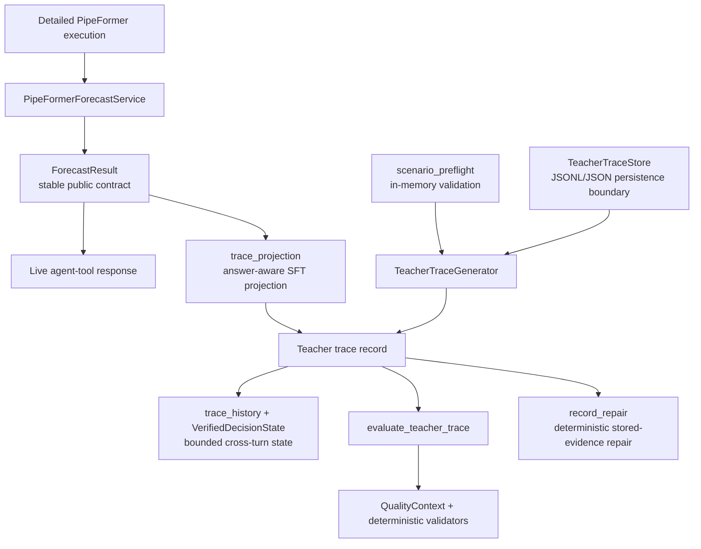

# Current Codebase Handoff — 2026-08-12

> **Status:** Current implementation handoff for the PipeClaw forecast-output, grounding, evaluator, and teacher-trace refactor.

## Scope and working-tree rule

This handoff covers the recently implemented PipeClaw work in:

- `pipeclaw/backend/pipeline/`
- `pipeclaw/backend/grounding/`
- `pipeclaw/backend/evaluator/`
- `pipeclaw/backend/task1/`

The repository has other uncommitted work, including Task 2 and documentation changes. Preserve it: do not use a reset, checkout, or broad cleanup as part of this refactor. No released/generated teacher-trace corpus was rewritten during this work.

The original implementation plan, its review, and the follow-up reduction plan are retained for history:

- `docs/superpowers/plans/2026-08-10-tool-output-contracts-and-sft-projection.md`
- `docs/review/2026-08-11-tool-output-contracts-refactor-plan-pattern-review.md`
- `docs/superpowers/plans/2026-08-12-forecast-result-cleanup-and-net-maintenance-reduction.md`

## Current architecture

### Ownership and contracts

| Concern | Current owner | Contract |
| --- | --- | --- |
| Public forecast output | `pipeline/forecast_result.py` | `ForecastResult` exposes a stable, compact result—not raw forecast time series. `compact_parsed_task` keeps at most eight relevant variable summaries and the total variable count. |
| Runtime execution | `pipeline/pipeformer_tool_runtime.py` | `PipeFormerForecastService` keeps detailed data internal and produces `ForecastResult` at the public boundary. |
| SFT/tool projection | `task1/trace_projection.py` | Projects canonical results into answer-aware trace evidence. It normally retains at most three forecast variables and obeys the 35k record budget. |
| Cross-turn memory | `task1/trace_history.py` and `grounding/decision_trace_state.py` | `VerifiedDecisionState` is the canonical persisted forecast-state representation. History preserves already-canonical `parsed_task` data instead of compacting it a second time. |
| Answer-quality checks | `evaluator/quality_context.py`, `evaluator/answer_quality.py`, `evaluator/quality_references.py`, `evaluator/numeric_grounding.py` | Trusted evidence is normalized once into `QualityContext`, then focused deterministic validators return stable issue IDs. |
| Exact grounding contracts | `grounding/contract.py` | Canonical disclosure and comparison contracts stay machine-readable here rather than being duplicated as broad free-text vocabulary checks. |
| CSV evidence | `grounding/evidence/csv.py` | `record_csv_evidence` is the shared record-level rebuild path for generation, evaluation, and numeric grounding. |
| Preflight | `pipeline/scenario_preflight.py` | Validation of variables, required files, registry/topology health, and source-ID collisions always runs before generation. Writing a JSON report is opt-in through an explicit output path. |
| Trace persistence | `pipeline/teacher_trace_store.py` | Shared JSONL-first loading, JSON fallback, merge/replacement, duplicate protection, sessions, splits, and stable IDs. It belongs in `pipeline/`, not `scripts/`. |
| Deterministic repair | `grounding/record_repair.py` and `task1/repair_teacher_trace.py` | Repairs stored evidence without an LLM call; repair tooling may explicitly request a preflight report. |

`pipeline/schemas.py` intentionally remains small: its two dataclasses are shared structural contracts. Do not move every local `@dataclass` into it; a dataclass should move only when it is genuinely a cross-module schema.

## Important behavioral invariants

1. **There are two intentional reductions, not one duplicate reduction.** Runtime execution becomes a stable public `ForecastResult` without raw series; trace projection then performs answer-aware evidence selection for the SFT budget. The second stage must remain.
2. **Canonical task data must not be compacted again in history.** The previous duplicate history compaction erased resolved-variable counts. History now copies canonical data unchanged.
3. **Preflight validation is required; `scenario_preflight.json` is not.** Normal generation and `--preflight-only` do not create a default report artifact.
4. **Only high-risk prose remains pattern-checked.** Exact contracts and typed evidence handle structured facts; free-text checks are restricted to claims that cannot be expressed structurally.
5. **Do not regenerate teacher traces merely because of this maintenance refactor.** Regeneration is only warranted if an intentional acceptance-policy change is approved.

## Replaced and removed paths

- `evaluator/teacher_quality.py` was replaced by the focused quality modules listed above.
- `grounding/pipeformer_projection.py` was removed; public shaping is now owned by `ForecastResult`.
- The runtime no longer owns a separate first-pass forecast compactor.
- Task 1 shared trace projection, history, source loading, and split export were moved out of the oversized generator so the generator remains orchestration-focused.

## Verification completed

- Focused tool-output-contract suite: **11 tests passed** in local `pipeclaw/tests/test_tool_output_contracts.py`, including the regression that rejects a stale saved comparison contract when canonical state is empty. The test directory is currently ignored, so this local suite is not yet versioned.
- Python compilation passed for the refactor modules, including generator, evaluator, repair, pipeline, grounding, and quality modules.
- Frozen-corpus audit against `pipeclaw/backend/generated_teacher_traces/teacher_trace.jsonl` found:

  | Check | Result |
  | --- | ---: |
  | Records inspected | 1,140 |
  | Successful forecast payloads | 210 |
  | `ForecastResult` normalization failures | 0 |
  | Resolved-variable count pairs | 154 |
  | Count mismatches | 0 |
  | Longest verified-evidence summary | 1,954 characters |
  | Summaries over the 2,000-character history limit | 0 |
  | State-restoration failures | 0 |

- `generate_teacher_trace --preflight-only` succeeds without creating the default `scenario_preflight.json` artifact.
- A deliberately invalid preflight correctly blocks missing required data.
- Import smoke checks passed for the Task 1 evaluator and repair modules.
- `graphify update .` refreshed the AST graph on 2026-08-12: 3,182 nodes, 7,141 edges, and 166 communities. The reported zero-node parser warnings are unrelated to this refactor; rerun `graphify update .` after future code changes.

`ruff` was not available in the bundled Python environment, so no Ruff result is recorded.

## LOC outcome

The scoped physical production-source measurement is deliberately strict: moving code to a support module earns no LOC credit.

| Measurement | Lines |
| --- | ---: |
| Frozen scoped baseline | 9,539 |
| Retained original files | 7,823 |
| New support modules | 1,694 |
| Shared CSV helper growth | +14 |
| Original refactor total, before the safe follow-up | 9,531 |
| **Original refactor net change** | **-8** |

The generator itself fell from 2,876 to 1,093 lines (-1,783), but the extracted reusable modules account for most of that movement. The net result is a meaningful ownership/dependency improvement with only a small measured source reduction so far.

The completed safe follow-up removed duplicated private paths and unused imports across 13 production files:

| Follow-up measurement | Lines |
| --- | ---: |
| Before | 9,335 |
| After | 9,216 |
| **Net change** | **-119** |

This is recorded separately because the follow-up also includes two Task 2 scripts that were outside the original narrow output-contract tally.

## Intentionally retained compatibility surface

The no-contract private reductions are complete. These candidates remain because removing them would change a public or undocumented import surface:

1. Keep `trace_projection.sanitize_tool_output`; it is an exported helper, so replacing it with direct `copy.deepcopy` would be an external Python API break for little benefit.
2. Keep `run_pipeformer_forecast_analysis` in `pipeline/pipeformer_tool_runtime.py`. There is no in-tree caller, but deleting it would break an undocumented external script importing the function.
3. Keep the public `TeacherTraceProjector` construction options and persisted trace payload fields; their removal would change callers or saved-record compatibility rather than merely delete dead code.

No API or persisted-record compatibility break was taken in this follow-up.

## Where to resume

1. Start with `pipeline/forecast_result.py` for public forecast shape and `task1/trace_projection.py` for answer-aware SFT shape.
2. For a quality issue, trace `evaluator/quality_context.py` → `evaluator/answer_quality.py` → `evaluator/numeric_grounding.py` before adding a new pattern. Every remaining pattern needs a named issue ID, evidence predicate, and positive/negative regression examples.
3. For historical-turn behavior, use `task1/trace_history.py` and `grounding/decision_trace_state.py`; do not rebuild an alternative forecast snapshot in the generator or evaluator.
4. For evidence rebuilding, use `grounding/evidence/csv.py::record_csv_evidence` rather than introducing another local CSV refresh helper.
5. After code edits, run the focused checks appropriate to the changed path and then run `graphify update .` from the repository root.
