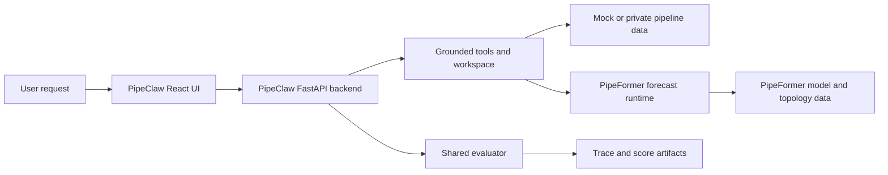

# Forecast-Grounded Decision QA

Source-first research and application code for grounded, auditable decisions on
natural-gas pipeline transient operations.

The repository has two cooperating components:

| Component | Purpose | Start here |
| --- | --- | --- |
| **PipeFormer** | Topology-aware, tokenized forecasting for pipeline networks. | [PipeFormer README](pipeFormer/README.md) |
| **PipeClaw** | FastAPI + React application, tool-grounded agent runtime, and evaluation harness. | [PipeClaw README](pipeclaw/README.md) |
| **Student distillation** | MS-SWIFT dataset preparation, fine-tuning, rollout, and evaluation. | [Student distillation README](pipeclaw/student_distillation/README.md) |

The common design principle is: compute first, explain second. Forecasts and
agent answers are backed by structured data, tool calls, and reviewable
artifacts rather than unsupported text.

## Quick start: run PipeClaw

Prerequisites: Python 3.10+, Node.js 18+, and npm 9+.

From the repository root, install the backend and create
`pipeclaw/backend/.env` with a model provider. Never commit that file or an API
key.

```env
LLM_PROVIDER=openai
OPENAI_API_KEY=your_key
OPENAI_MODEL=your_model
# OPENAI_API_BASE=https://your-openai-compatible-endpoint/v1
```

```bash
python -m pip install -r pipeclaw/backend/requirements.txt
python -m pipeclaw.backend.main
```

The API listens on `http://localhost:8003`. In a second terminal, start the
React frontend:

```bash
cd pipeclaw/frontend
npm install
npm run dev
```

Open `http://localhost:3000`. The Vite development server proxies `/api` and
`/assets` to the backend. The bundled `pipeclaw/backend/pipeline_data/` is
synthetic demo data, so the flow endpoints work without private operational
files. Replace that directory with a compatible internal dataset when needed;
see [its README](pipeclaw/backend/pipeline_data/README.md).

## Quick start: run PipeFormer on the mock fixture

PipeFormer is a separate Python package. From `pipeFormer/`:

```bash
python -m pip install -r requirements.txt
python scripts/create_mock_pipeformer_data.py --force
python build_cache.py --data-dir data/mock_lifecycle --static-dir data/mock_lifecycle/static/mock_lifecycle --skip-tokens --force
python data/compute_tokenizer_stats.py --data_dir data/mock_lifecycle --static-dir data/mock_lifecycle/static/mock_lifecycle --force
python build_cache.py --data-dir data/mock_lifecycle --static-dir data/mock_lifecycle/static/mock_lifecycle --force
python data/compute_normalization_stats.py --static_dir data/mock_lifecycle/static/mock_lifecycle --method standard --force
python scripts/train_mock_causal.py --config configs/mock_decoder.json
```

The fixture is synthetic and not physically validated. The generated files and
the rationale for each step are documented in
[data/mock_lifecycle/README.md](pipeFormer/data/mock_lifecycle/README.md).

## Student distillation training

Student distillation uses its own Python 3.12/MS-SWIFT environment. The normal sequence is:

```bash
conda env create -f pipeclaw/student_distillation/environment.yml
conda activate task2-ms-swift
```

Prepare and validate the derived datasets from the repository root in an
environment that can import the backend:

```bash
python -m pipeclaw.student_distillation.scripts.prepare_dataset
python -m pipeclaw.student_distillation.scripts.validate_dataset
```

Then choose a reviewed configuration under
[pipeclaw/student_distillation/configs/](pipeclaw/student_distillation/configs/README.md).
The student-distillation documentation explains token profiling, local smoke
tests, remote training, autonomous evaluation, and GRPO.

## How the pieces fit



PipeClaw keeps execution, evidence, and evaluation separate. PipeFormer owns
the forecasting model and preprocessing stack. Student distillation converts
finalized teacher traces into training projections and evaluates student
rollouts with the same backend evaluator.

## Repository map

- `pipeFormer/` — model, graph construction, tokenization, caching, training,
  and synthetic fixtures.
- `pipeclaw/backend/` — FastAPI service, agent runtime, grounded tools,
  evaluator, pipeline runtime, and released task data.
- `pipeclaw/frontend/` — Vite + React interface for flow exploration and agent
  interaction.
- `pipeclaw/student_distillation/` — MS-SWIFT data, training configurations,
  rollout harness, and evaluation scripts.
- `pipeclaw/huggingface_dataset/` — JSONL dataset repository and upload helpers.
- `docs/` — project notes and session handoffs.

Useful component guides:

- [Backend tools](pipeclaw/backend/agent/tools/README.md)
- [Evaluator](pipeclaw/backend/evaluator/README.md)
- [Student-distillation data](pipeclaw/student_distillation/data/README.md)
- [Hugging Face dataset](pipeclaw/huggingface_dataset/README.md)
- [PipeFormer tokenizer](pipeFormer/data/tokenizer_save/README.md)
- [Compressor-curve embeddings](pipeFormer/data/process_eq_argu/README.md)

## Data and research notes

The public runtime contains mock data and released task artifacts, not the
original private operational flow base. Do not use the mock fixture as evidence
for production decisions or physical-model validation.

The repository also includes the project papers as local PDFs:

- [Forecast-Grounded Decision QA for Gas Pipeline Transient Operation](Forecast-Grounded_Decision_QA_for_Gas_Pipeline_Transient_Operation_EN.pdf)
- [PipeFormer/PipeClaw schedule](PipeFormer_PipeClaw_Schedule.pdf)

The source tree is the supported consumption mode; no package-registry or
binary release is assumed.

## License status

This repository does not currently include a `LICENSE` file. Add and verify a
license before distributing the code outside your organization.
