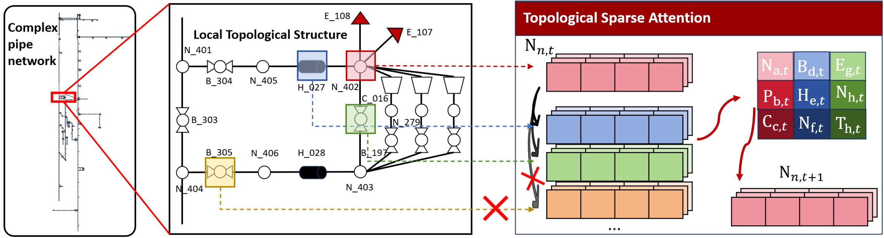
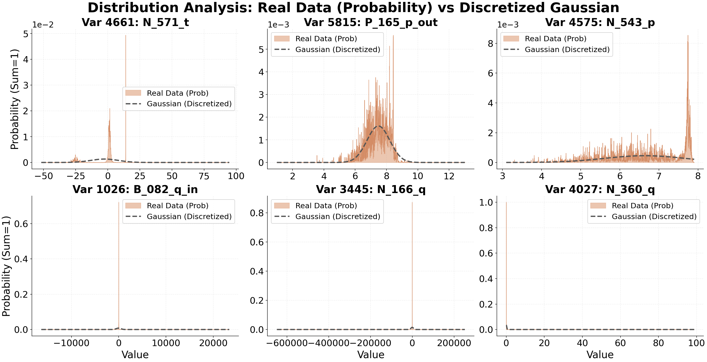
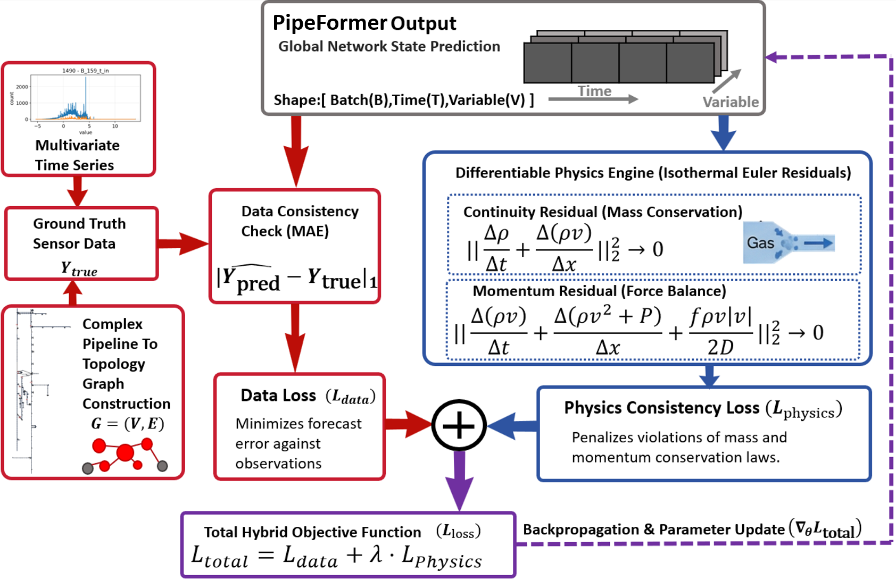
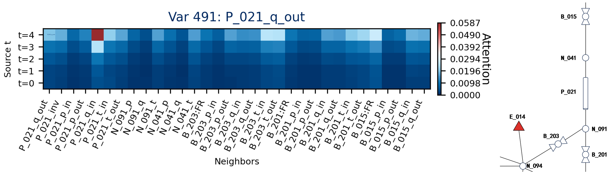
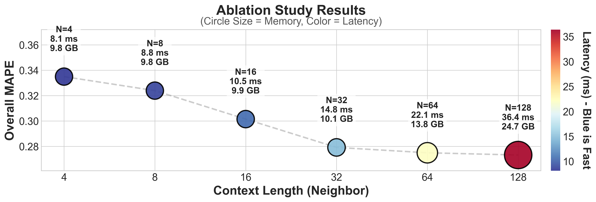

# PipeFormer：一种面向天然气管网的物理启发离散化稀疏 Transformer

[English Version](README.md)

PipeFormer 是一个面向论文复现与开源阅读的代码发布包，聚焦于大规模天然气管网瞬态预测中的核心 decoder、拓扑预处理、离散化 token 流水线、训练脚手架以及论文配图。目标不是只给出一个“能跑的模型目录”，而是让读者能够把论文中的方法设计、实验结论和仓库里的实现入口一一对应起来。

论文研究的任务是工业级天然气管网数字孪生中的短时瞬态预测。在论文设定里，模型使用过去 5 分钟的系统状态，预测未来 5 分钟的演化，时间分辨率为 1 分钟。整个系统覆盖超过 1000 个物理节点、6712 个建模变量，状态中既有压力、流量、温度，也有设备状态与边界控制量。

## 论文链接

- 期刊页面：https://www.sciencedirect.com/science/article/pii/S2667143326000417
- DOI：[`10.1016/j.jpse.2026.100472`](https://doi.org/10.1016/j.jpse.2026.100472)

## 论文里的任务设定

论文把天然气管网瞬态仿真重新表述成一个图上的多变量预测问题。每个时间步对应 1 分钟，历史窗口长度为 `L = 5`，预测步长为 `H = 5`。目标变量主要是压力、流量和温度，辅助输入则包括阀门状态、压缩机相关量以及调度端给定的边界设定值。

这个任务难点很明确：

- 调度场景要求推理速度远快于传统数值仿真。
- 真实运行数据在设备切换和人工干预下呈现明显的非高斯、长尾、多峰特征。
- 预测结果不能只是“数值上像”，还需要尽量贴近流体动力学规律。

## 方法拆解

PipeFormer 在论文里由四个核心设计组成：

- 拓扑图建模：把管网抽象成图，节点对应管段、站点、阀门、压缩机、用户等物理部件。
- 拓扑感知稀疏注意力：每个变量只关注通过局部拓扑搜索得到的相关邻域。论文默认使用 `K = 32` 个邻域上下文，把注意力复杂度从 `O(N^2)` 降到 `O(NK)`。
- 离散化 token 表示：把连续传感器数值映射到离散符号上，让模型预测 token 而不是直接回归所有标量。论文对连续变量采用 4096 级粒度，而像球阀开关这类天然离散变量可以保持二值表示。
- 物理约束目标：在数据误差之外，再加入连续性方程和动量方程残差，把压力和流量预测往更符合物理规律的方向引导。

这个开源包当前主要公开的是“离散化 + 稀疏 decoder + 预处理流水线”这条主线。论文中的 physics-informed 目标在这里保留了方法语义和配图说明，方便读者理解整套思路；而具体训练入口则以当前发布包中的 decoder 训练实现为主。

## 论文结果要点

- 工业测试集整体 MAPE：`27.1%`
- 工业测试集整体 MAE：`57,711`
- 论文中表现最强的对比基线是 TLPN，整体 MAPE 为 `35.6%`，PipeFormer 相对误差下降约 24%
- 邻域范围消融显示 `K = 32` 是一个很强的折中点，对应单步推理延迟 `14.8 ms`
- 离散化消融显示：整体 MAPE 从 `56.0` 先下降到 `32.4`，再在加入论文中的物理约束后下降到 `27.1`

论文里还特别解释了为什么某些场景下 MAE 和 MAPE 看起来不完全同步。原因是网络中不同变量的量级差异很大，大流量或库存变量更容易主导 MAE，而大量小量级压力变量会更明显影响 MAPE。

## 仓库导览

- `build_graph.py`：从静态网络资源生成拓扑工件、子图资源和可编辑预测掩码。
- `build_cache.py`：基于选定静态图生成训练/验证缓存序列。
- `data/topology_attention_index.py`：构建稀疏注意力需要的邻域索引。
- `data/tokenizer_save/` 与 `data/compute_tokenizer_stats.py`：生成并保存离散化词表与 token 元数据。
- `models/decoder/model.py`：decoder-only 主模型实现。
- `models/decoder/attention.py` 与 `models/decoder/masks.py`：稀疏注意力计算与 mask 构造。
- `training/trainer.py`：当前发布版模型训练所使用的 HuggingFace 风格训练封装。

## 论文简介

### 1. 整体架构与稀疏注意力



这张图应该从左往右看。左边是完整工业管网，中间是从大图中截取出来的局部邻域，右边是模型真正做预测时使用的历史嵌入表示。核心信息是：目标变量不会和全网所有变量做全连接注意力，只会和自己、同设备变量以及物理上相邻的局部组件交互。

### 2. 为什么必须做 token 化



这张图解释了为什么论文没有把问题简单处理成普通回归。随机抽样的真实变量分布存在显著长尾、偏态和多峰现象，训练集与验证集也都明显偏离标准高斯分布。离散化 token 的目的，就是在这种工业数据分布下让模型训练更稳。

### 3. 论文中的训练目标是什么



论文中的损失函数由两部分组成：一部分拟合观测数据，另一部分通过可微物理模块惩罚连续性和动量守恒残差。它对应的是“序列预测模型如何接上流体动力学约束”这个关键问题。

### 4. 注意力为什么是可解释的



这张图是论文对可解释性的直接验证。对于管段流出量 `P_021_q_out`，模型最关注的是同一管段的流入量 `P_021_q_in`，其次显著关注上游阀门 `B_015`。这说明稀疏注意力不仅仅是在节省计算，还学到了符合物理直觉的上游依赖关系。

### 5. 为什么论文选择 `K = 32`



横轴是邻域长度 `K`。随着邻域扩大，模型先明显变准，但显存和推理延迟也会一起上升。论文最终选择 `K = 32`，因为它已经能提供足够的空间上下文，同时又避免了更大邻域带来的计算代价。

### 6. 瞬态预测到底表现成什么样


这张图展示的是代表性工况下的时间序列预测。最重要的观察点不是“平均误差更低”这句结论本身，而是当压力或流量发生快速变化时，PipeFormer 跟随突变的速度明显快于对比模型，这正是实时调度场景最看重的能力。

## 快速开始

```bash
python build_graph.py --build-attn --static-dir data/static/<your_static_dir>
python build_cache.py --data-dir data --static-dir data/static/<your_static_dir> --skip-tokens --force
python data/compute_tokenizer_stats.py --data_dir data --static-dir data/static/<your_static_dir> --cache_dir data/static/<your_static_dir>/cache --force
python data/compute_normalization_stats.py --static_dir data/static/<your_static_dir> --method standard
python train.py --config configs/quick_test_decoder.json
```

这些命令默认你已经准备好了兼容的序列数据和静态拓扑资源。`configs/quick_test_decoder.json` 更适合先验证数据链路和训练链路是否接通，再扩展到更完整的实验。

## 建议阅读顺序

- 先看 `models/decoder/model.py`、`models/decoder/attention.py` 和 `models/decoder/masks.py`，理解稀疏拓扑注意力是怎么在代码里落地的。
- 再看 `data/topology_attention_index.py`、`build_graph.py` 和 `build_cache.py`，把邻域索引、缓存构建和图工件组织方式串起来。
- 接着看 `data/tokenizer_save/` 和 `data/compute_tokenizer_stats.py`，对应论文里的离散化建模部分。
- 最后看 `training/trainer.py` 和 `train.py`，理解当前发布包如何训练和评估 decoder 模型。
