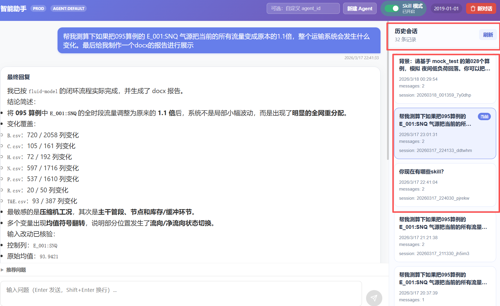
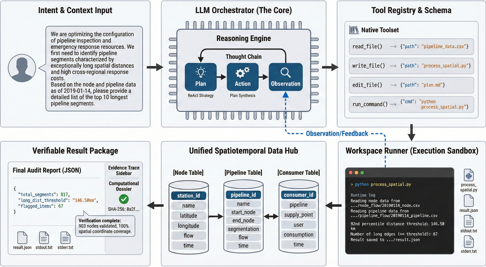
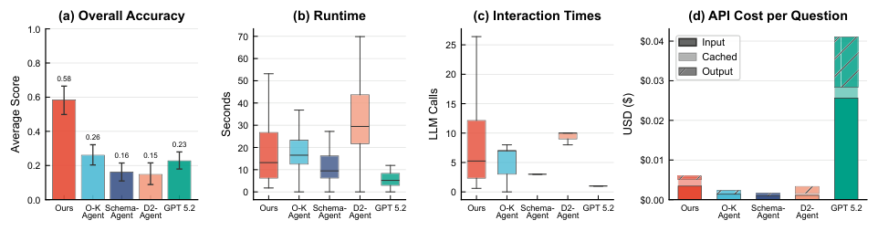
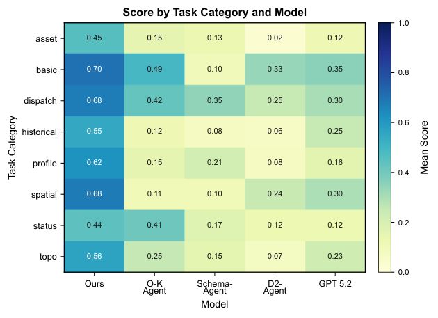
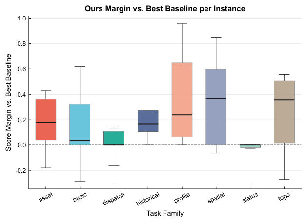
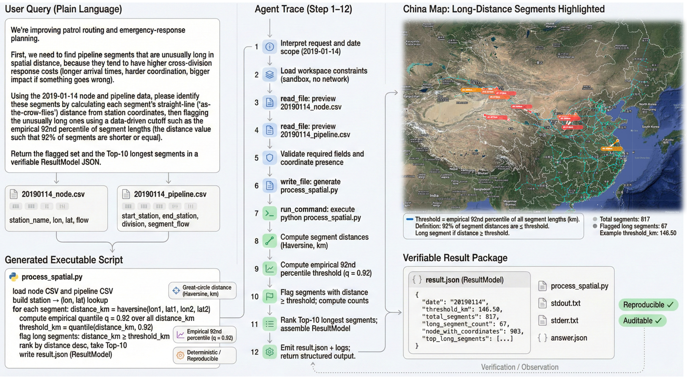

# PipeClaw

[README_zh](README_zh.md) | [How To Run](how_to_run.md)

PipeClaw is a trace-first lifecycle evaluation and agent runtime package for natural gas pipeline operations. It is designed for questions that mix GIS assets, network topology, and time-indexed operational measurements, where correctness and auditability matter more than fluent text generation.

This open-source repository continues the project under the PipeClaw name. The corresponding paper presents the earlier research system under the name Pipeline-Agent:
[Pipeline-Agent: A Comprehensive Decision Support System for Natural Gas Pipelines via Verifiable Computational Reasoning](https://www.sciencedirect.com/science/article/pii/S2667143326000429)

The project follows a simple rule from the paper: compute first and explain after. Instead of answering directly in free-form text, the agent writes and runs deterministic scripts in a sandboxed workspace, records the intermediate artifacts, and returns a result package that can be replayed and checked by engineers.

## Why PipeClaw

Natural gas pipeline decisions often depend on data that lives in different systems and uses inconsistent identifiers. A single mismatch can silently drop records, distort balances, or select the wrong assets. PipeClaw addresses this problem with a verifiable computation workflow built around explicit planning, deterministic execution, and saved evidence.

## Project Structure

- `backend/`: FastAPI service, agent runtime, execution loop, and the public API layer.
- `backend/pipeclaw_data/`: released PipeClaw subcomponent files and scenario resources.
- `frontend/`: Vite + React interface for interactive exploration of flows, dates, node details, and agent interactions.
- `docs/images/`: paper figures rendered into GitHub-displayable assets.
- `huggingface_dataset/`: push-ready Hugging Face dataset repository for the released `llm_data` and `pipeclaw_data` artifacts.

## Frontend and Backend Loading

The project is meant to run as a full stack system rather than a paper-only artifact.

- From the repository root, run `python -m pipeclaw.backend.main` to start the FastAPI service on `http://localhost:8003`.
- The frontend entrypoint is `npm run dev` inside `frontend/`, which starts the Vite development server.
- `frontend/src/api/client.ts` uses `/api` as the base path, and `frontend/vite.config.ts` proxies `/api` and `/assets` to `http://localhost:8003` during development.
- The backend exposes flow and date APIs such as `/api/flow/nodes`, `/api/flow/pipelines`, `/api/flow/consumers`, and `/api/dates`, together with agent endpoints under `/api/agent/*`.
- In practice, the frontend loads pipeline flow data and agent responses from the backend, so GitHub users can understand the project as a runnable product, not only as a paper companion.

## Public Datasets

The open-source package also includes a release-ready Hugging Face dataset repo under `huggingface_dataset/`. It contains the original JSON files under `raw/`, JSONL files under `data/` for Dataset Viewer compatibility, and helper scripts for validation and publishing. The main app does not ship the original private operational flow base.

- Supported dataset configs: `llm-question-all`, `llm-question-template-80`, `llm-question-template-all`, `pipeclaw-v2`, `pipeformer-v4`, `pipeformer-v7`
- One-command upload: `python huggingface_dataset/scripts/upload_to_hf.py --repo-id zly7/pipeclaw-open-datasets`
- If `HF_TOKEN` is not already present in the environment, the upload script prompts for it securely.
- After upload, users can download with `snapshot_download(...)` or load directly with `load_dataset("zly7/pipeclaw-open-datasets", "pipeclaw-v2", split="train")`.

## Interface Showcase

### Frontend Workspace

This screenshot shows the main product interface, including the agent controls, current conversation canvas, final answer area, and the session history panel on the right for revisiting previous runs.

### Word Parsing And Report Case

This case highlights a document-oriented interaction flow: the user asks for an analysis together with a `.docx` report, and the interface presents the structured final response directly in the chat workspace.

## Core Ideas

- Unified spatiotemporal schema: asset locations, network links, and daily operational measurements are aligned into a stable tabular format.
- Explicit plan artifact: each run maintains a persistent plan file so the reasoning process is visible and reviewable.
- Tool-grounded execution: the agent performs calculations by running scripts instead of relying on unsupported text-only reasoning.
- Verifiable result package: outputs are paired with scripts, logs, and intermediate files so the final answer can be audited.

## Workflow

1. Translate a user request into an explicit plan.
2. Load the required node, pipeline, and consumer tables.
3. Generate a small analysis script inside the workspace.
4. Run deterministic checks on schema, identifiers, and task-specific constraints.
5. Return structured results together with reproducible evidence.

## Paper Figures

### System Overview

This figure explains the system architecture in three stages: a user request is first grounded into an explicit plan and task context, then the backend executes deterministic scripts over the pipeline tables inside a constrained workspace, and finally the system returns a verifiable result package containing outputs, intermediate artifacts, and execution logs for review.

### Aggregate Performance

This figure presents the overall evaluation snapshot across the benchmark, showing the score, stability, and cost-related tradeoffs of the approach at the system level rather than on a single isolated task.

### Category Heatmap

This heatmap compares performance across task categories and highlights where the workflow is strongest, especially on questions that require multi-table aggregation, structured reasoning, and tight numerical consistency.

### Margin vs Best Baseline

This figure emphasizes the per-category margin over the strongest baseline, making it easier to see where the explicit planning and tool-grounded execution pipeline delivers the clearest gains.

### Case Study

This case study shows a concrete analysis trace, including generated code, intermediate outputs, and the final inspected result, illustrating how PipeClaw turns a natural-language request into an auditable engineering workflow.

## Repository Contents

- `backend/agent` and `backend/executor`: trace-first runtime and execution loop
- `backend/pipeclaw_data`: released PipeClaw subcomponent files included in this package
- `frontend/`: runnable interface for interactive exploration
- `huggingface_dataset/`: ready-to-publish dataset repo plus upload helpers
- `docs/images/`: paper figures prepared for direct GitHub display
- `how_to_run.md`: bilingual environment setup and run instructions

## Quick Start

1. Install backend dependencies: `pip install -r pipeclaw/backend/requirements.txt`
2. Install frontend dependencies: `cd pipeclaw/frontend && npm install`
3. From the repository root, start backend: `python -m pipeclaw.backend.main`
4. Start frontend: `cd pipeclaw/frontend && npm run dev`

For a step-by-step setup guide, see [how_to_run.md](how_to_run.md). The aligned Chinese version is available in [README_zh.md](README_zh.md). The repository is runnable out of the box with the bundled mock `backend/pipeline_data/`, while the original private operational flow base remains excluded.
